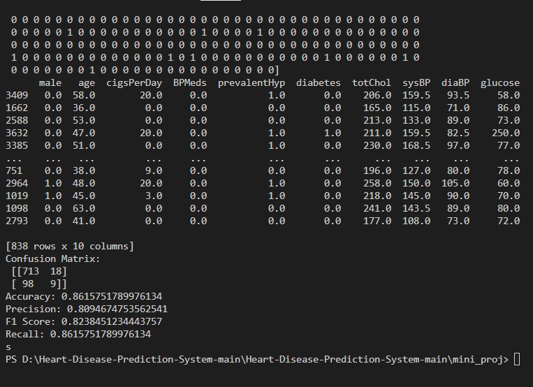

# Heart Disease Risk Predictor

A machine learning-based web app developed to predict the risk of heart disease based on health indicators. This full-stack solution combines a trained classification model, a Flask-powered backend, and a responsive frontend.

## Tech Stack

- **Frontend**: HTML, CSS, JavaScript
- **Backend**: Python (Flask)
- **ML Models**: Logistic Regression, Random Forest, KNN, SVM
- **Libraries**: scikit-learn, pandas, matplotlib
- **Dataset**: Framingham Heart Study

## Project Preview

